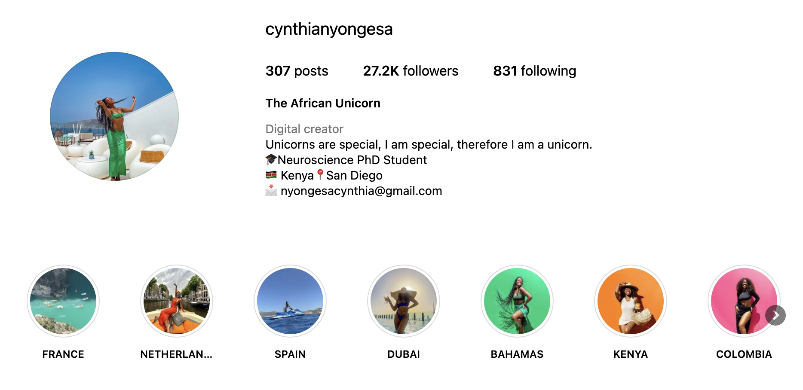

# Graduate Student Research Scientist 

# 👋 About 
I’m Cynthia Nyongesa (“Nyo-nge-sa”), and I’m a 3rd Year Doctoral student in the Neurosciences Graduate Program at UC San Diego. I also was a teachers assistant for the Winter 200B: Basic Neurosciences: System Neurobiology (NEU 200B) course and run the African Graduate Students Association at UCSD – take a look at our awesome projects [here](https://gpsa.ucsd.edu/about/executive-committee/diversity-affairs.html).

I graduated with BS and MS degrees in Neuroscience from Pomona College & UC San Diego in 2019 and 2023, respectively. There, I was advised by Dr. Richard Lewis and Dr. Judy Pa to help develop statistical tools to optimize high-dimensional clinical data in Python & C#. I’m originally from Nairobi, Kenya 🇰🇪.

Feel free to email me at cnyongesa@ucsd.edu or check out the resources listed below.

# 🎓 Education 

## Ph.D., Computational Neuroscience, Expected Sep ‘26 UC San Diego, CA

Dissertation: Using Multimodal Machine Learning Methods to Develop Digital Biomarkers in Aging
Advisor: Judy Pa, PhD 

## M.Sc., Computational Neuroscience, May ‘23
UC San Diego, CA

Thesis: Language-Based Disease Detection: Bridging AI and Speech for Early Intervention in Alzheimer's. 
Cumulative GPA: 3.97 

## B.A., Neurosciences, May ‘19 Pomona College, Claremont, CA 
Thesis: Using Computer Vision to Monitor Autism Spectrum Disorders Advisor: Richard Lewis, Ph.D 
Cumulative GPA: 3.61 

# 👩🏽‍🏫 Work Experience
## Graduate Student Researcher/Programming Intern @ Alzheimer's Disease Cooperative Study, San Diego, CA (Oct 2022 – Present)
 - Utilizing NumPy for python for data analysis on virtual reality acclimation trial data, reducing motion sickness risk by 20% and conducting research on virtual reality-based cognitive training and applied natural language processing in OpenAI, NLK and spaCy for Alzheimer's speech analysis.
- Employing C# for assessing salient and non-salient signals in way-finding VR tasks using eye tracking and pupillometry metrics. Advised by Dr. Judy Pa, PhD.

# 📝 Scholarships
- United World College Davis Leadership Full Tuition Scholarship
- Summer Undergraduate Research Program (SURP), Pomona College

# 🏆 Awards
- The Alzheimer's Association International Conference (AAIC) Speaker Fellowship
- Pomona College President’s Funding Recipient
- Graduate & Professional Student Associations: EDI Fellowship
- United World College Costa Rica Research Fellowship

# 🥳 You made it this far!

